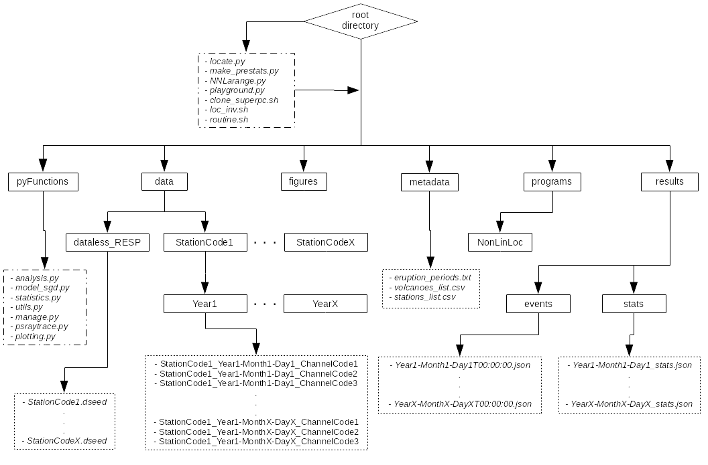

# TremRoutine 1.0

Repository of automatic processing routine for volcanic tremor signals based on polarization analysis.

The code here was made for the master thesis named "Detection and Location of Tremor signals: A case study from East Java, Indonesia".

## Table of Contents
* [General Info](#general-info)
* [Installation](#installation)

## General Info

Due to confidentiality of ERC-funded Lusi Lab project, the initial dataset cannot be shared (waveform files and response files) as well as the results. Therefore, the "data" and "results" folders shown in the architecture scheme of the program are not included. However, any used dataset must be organized in the specified hierarchycal order of the folders. The content inside "results" will be automatically generated.

The folder "pyFunctions" contains most of the Python files that has the methods for manipulation files around the architecture, between the third-party codes and the other folders, detectino and association steps, polarization analysis, plotting functions, and statistics of the detections acheived.

All images that can be produced will be stored in the folder called "figures" if running the plotting functions inside "pyFunctions/plotting.py" and deciding to save them. Currently no folder named "figures" is presented by the same confidentiality agreement, as the files also present results. A folder called with the same name can just be created from scratch by the user.

The "metadata" folder contains files related to the position of stations and volcanoes. Also other priori information can be saved here.

The "programs" folder is designed to contain third-party codes and external programs such as NonLinLoc (Lomax, 2004) that can be used for the location part. Normally this code is designed to work with NonLinLoc installed/compiled within a folder called "NonLinLoc" inside of the "programs" folder. Internal executions for travel-time calculations and probailistic model must be made before with the comands of NonLinLoc locally on the folder of the code.

## Installation
